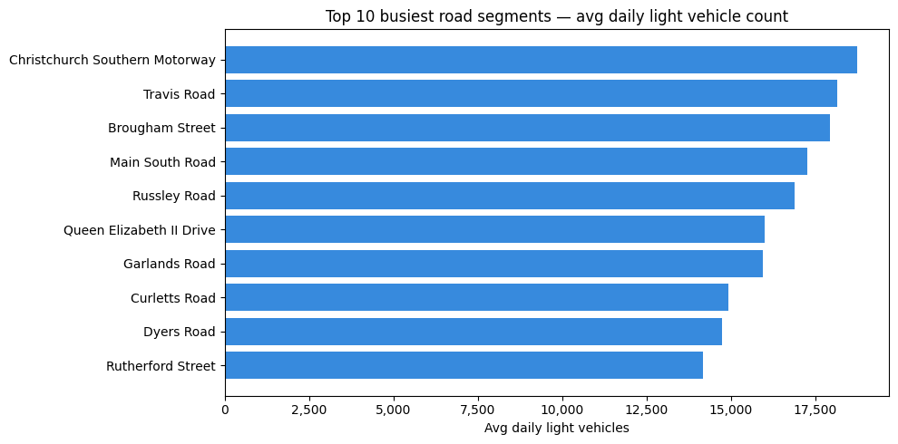
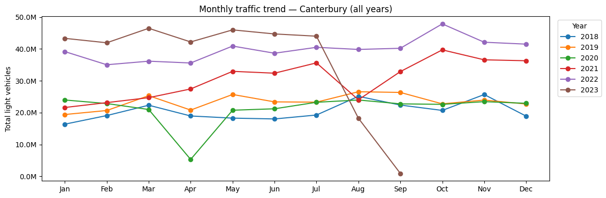
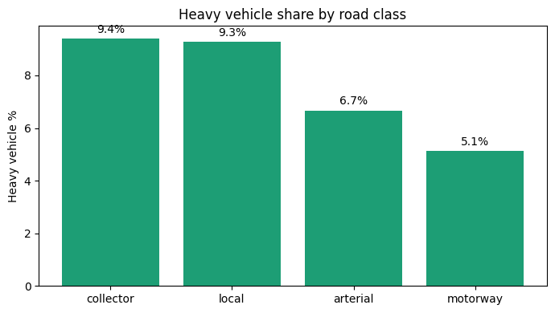
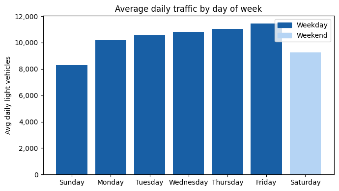
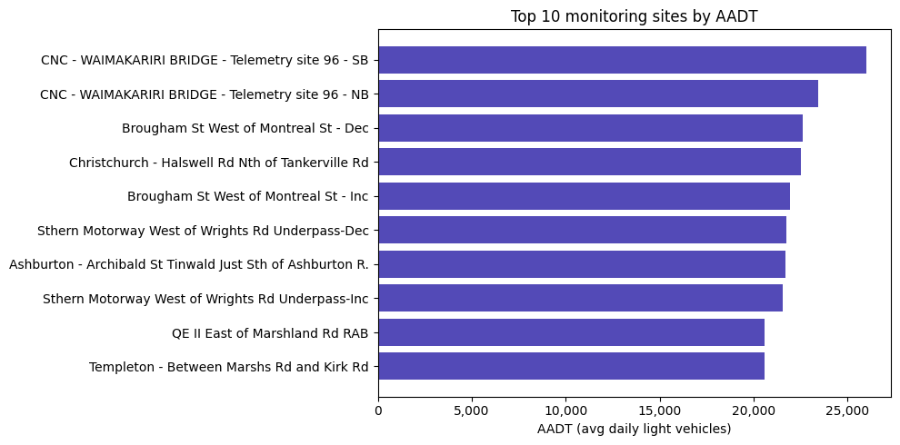

# Road Network ETL Pipeline

A multi-cloud data engineering pipeline that ingests public road and traffic data, transforms it through the **Medallion architecture** (bronze → silver → gold), and serves a star schema ready for analysis.

---

## Architecture

```
┌─────────────────────────────────────────────────────────────────────┐
│  Ingestion (AWS)                                                     │
│                                                                      │
│  upload_to_s3.py                                                     │
│  ├── OpenStreetMap (live via osmnx)      ──►  S3 raw landing zone   │
│  └── Waka Kotahi TMS (manual download)  ──►  nz-road-pipeline-raw  │
│                                                    │                 │
│                                          EventBridge + Lambda        │
└─────────────────────────────────────────────────────────────────────┘
                                                     │
                                                     ▼
┌─────────────────────────────────────────────────────────────────────┐
│  Storage & Transformation (Azure)                                    │
│                                                                      │
│  ADLS Gen2 — medallion container                                     │
│  ├── bronze/   raw parquet (date-partitioned, append-only)          │
│  ├── silver/   cleaned Delta tables                                  │
│  └── gold/     star schema Delta tables                              │
│                                                                      │
│  Databricks Workflow: silver_layer → gold_layer                      │
└─────────────────────────────────────────────────────────────────────┘
```

---

## Data sources

| Source | Dataset | Format | Refresh cadence |
|--------|---------|--------|-----------------|
| [OpenStreetMap](https://www.openstreetmap.org) via `osmnx` | Christchurch drive network | GeoParquet | Fetched live each pipeline run |
| [Waka Kotahi NZ Transport Agency](https://opendata-nzta.opendata.arcgis.com) | TMS daily traffic counts | CSV → Parquet | Manual download — see `DATA_SOURCES.md` |
| [Waka Kotahi NZ Transport Agency](https://opendata-nzta.opendata.arcgis.com) | State highway monitoring sites | CSV → Parquet | Manual download — see `DATA_SOURCES.md` |

> **Note on Waka Kotahi data:** The ArcGIS Hub download URLs change periodically when Waka Kotahi updates their open data portal. Rather than hardcoding a URL that may break, the pipeline treats the Waka Kotahi CSVs as manually-managed inputs. Download instructions and the exact datasets used are documented in [`DATA_SOURCES.md`](DATA_SOURCES.md). The pipeline is designed to be re-run whenever a new data export is published.

---

## Medallion layers

### Bronze
Raw data landed as-is — no transformations, no cleaning. Date-partitioned so every pipeline run is preserved and reprocessable.

- `bronze/osm/christchurch/<date>/road_segments.parquet`
- `bronze/osm/christchurch/<date>/road_nodes.parquet`
- `bronze/waka_kotahi/<date>/tms_daily_traffic_counts.parquet`
- `bronze/waka_kotahi/<date>/tms_monitoring_sites.parquet`

### Silver
Cleaned and standardised Delta tables. Key transformations:

- OSM road segments: `maxspeed` parsed to integer km/h, highway type classified into road classes (motorway, arterial, local etc.), geometry reprojected from WGS84 to NZTM2000 (EPSG:2193)
- TMS counts: filtered to Canterbury region, dates parsed, aggregated to site/date/vehicle class grain
- TMS sites: filtered to active sites with valid coordinates, joined to active count sites

### Gold
Star schema optimised for analytical queries.

```
fact_traffic_counts
├── date_id      → dim_time        (date, year, month, day_of_week, is_weekend)
├── site_id      → dim_location    (site, region, easting, northing, segment_id)
├── segment_id   → dim_road_segment (name, road_class, maxspeed_kmh, length)
├── vehicle_class
└── daily_count
```

---

## Sample analyses

### Top 10 busiest road segments


### Monthly traffic trend — Canterbury


### Heavy vehicle share by road class


### Average traffic by day of week


### Top 10 monitoring sites by AADT


---

## Project structure

```
nzta_etl_project/
├── cloud_related_files/
│   ├── upload_to_s3.py              # Ingestion script — OSM (live) + Waka Kotahi (local)
│   ├── s3_to_adls_lambda.py         # AWS Lambda — streams S3 objects to ADLS bronze
│   ├── s3_trigger_setup.tf          # Terraform — S3 bucket + EventBridge + Lambda + IAM
│   ├── build_lambda.sh              # Packages Lambda for deployment
│   └── README_aws_ingestion.md      # AWS setup instructions
├── notebooks/
│   ├── silver_layer_databricks.ipynb
│   ├── gold_layer_databricks.ipynb
│   └── gold_analysis.py             # SQL analysis queries + charts
├── downloads/                       # Raw source files (not committed — see .gitignore)
├── DATA_SOURCES.md                  # Data provenance and refresh instructions
└── README.md
```

---

## Running the pipeline

### Prerequisites
- AWS CLI configured (`aws configure`)
- Databricks CLI configured with secret scope `adls` containing the ADLS storage key
- Terraform installed
- Python environment with `osmnx`, `boto3`, `geopandas`, `pandas`, `pyarrow`

### First-time setup
```bash
# Deploy AWS infrastructure
cd cloud_related_files
./build_lambda.sh
terraform init
terraform apply -var="azure_sas_token=<your-sas-token>"
```

### Running a pipeline update
```bash
# 1. Upload raw data to S3 (Lambda auto-copies to ADLS bronze)
python upload_to_s3.py --date 2026-03-20

# 2. Trigger Databricks workflow (silver → gold)
#    In Databricks: Jobs → road_pipeline_silver_gold → Run now with parameters
#    Parameter: bronze_date = 2026-03-20
```

> **When to re-run:** The OSM road network is fetched live on each run. The Waka Kotahi traffic counts are a historical snapshot (2018–2022) that should be refreshed manually when Waka Kotahi publishes a new export. See `DATA_SOURCES.md` for download instructions.

### Skipping individual sources
```bash
python upload_to_s3.py --date 2026-03-20 --skip-osm            # Waka Kotahi only
python upload_to_s3.py --date 2026-03-20 --skip-waka-kotahi    # OSM only
```

---

## Security

- ADLS storage key stored in a **Databricks Secret Scope** — never in notebook code
- Azure SAS token passed to Lambda via environment variable set in Terraform — never committed to Git
- AWS credentials managed via `~/.aws/credentials` — never hardcoded
- `downloads/` directory excluded from Git (see `.gitignore`)

---

## Known limitations & future work

- **Silver/gold overwrite on each run** — currently uses `mode="overwrite"` so only the latest run's data is retained in silver and gold. A production pipeline would use Delta Lake `MERGE INTO` (upsert) to accumulate history across runs.
- **Waka Kotahi data is a static snapshot** — the 2018–2022 CSV is a point-in-time export. The pipeline is designed to be re-run when new exports are published but does not poll for updates automatically.
- **No orchestration trigger from Lambda to Databricks** — currently the Databricks workflow must be triggered manually after the Lambda copies files to bronze. A production setup would use Azure Data Factory or a Databricks webhook to chain these automatically.
- **Canterbury-only silver filter** — the silver layer filters TMS counts to Canterbury region to match the Christchurch OSM road network. This could be parameterised to support other regions.

---

## Tech stack

| Layer | Technology |
|-------|-----------|
| Raw ingestion | Python (`osmnx`, `boto3`, `geopandas`) |
| Raw storage | AWS S3 |
| Event trigger | AWS EventBridge + Lambda |
| Cloud transfer | Azure Blob REST API (via `requests`) |
| Data lake | Azure Data Lake Storage Gen2 |
| Transformation | Databricks (PySpark + pandas UDFs) |
| Table format | Delta Lake |
| Orchestration | Databricks Workflows (Jobs) |
| Infrastructure | Terraform |
| Spatial ops | geopandas, shapely, pyproj (NZTM2000) |
